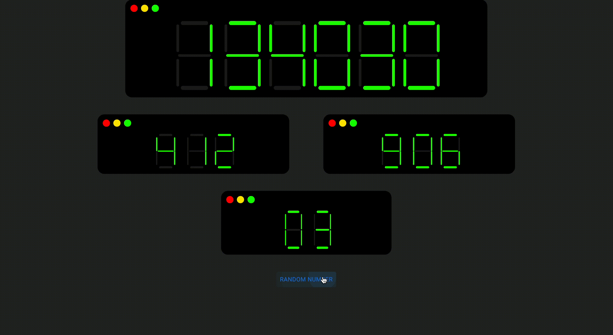
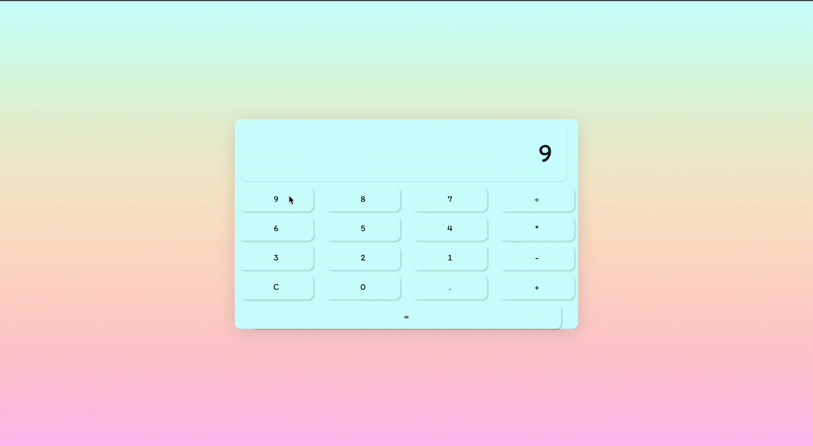
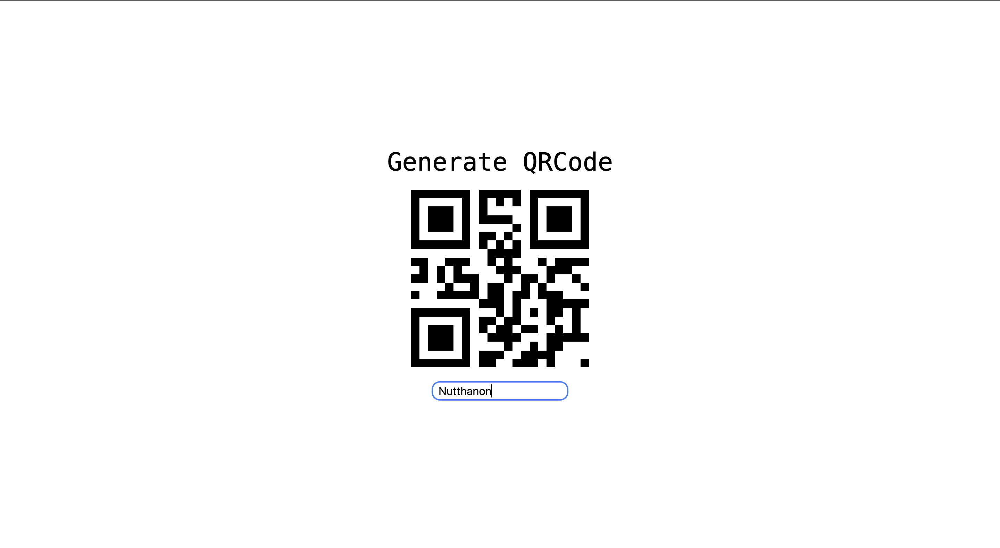
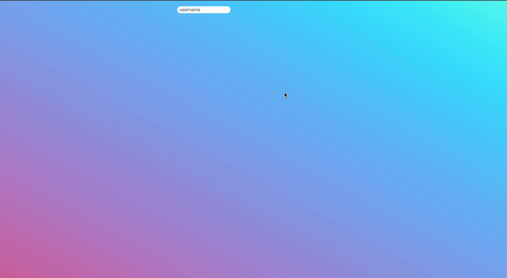

# Fun project with react

- [Random lottery number](#random-lottery-number)
- [Accordion](#accordion)
- [Calculator](#calculator)
- [Dark Light mode](#dark-light-mode)
- [macos](#macos)
- [Text to QRCode](#text-to-qrcode)
- [Todolist](#todolist)
- [troll input](#troll-input)

# Random lottery number

# Accordion

# Calculator

# Dark Light mode

    

# Macos

# Text to QRCode

# Todolist

# Troll input

